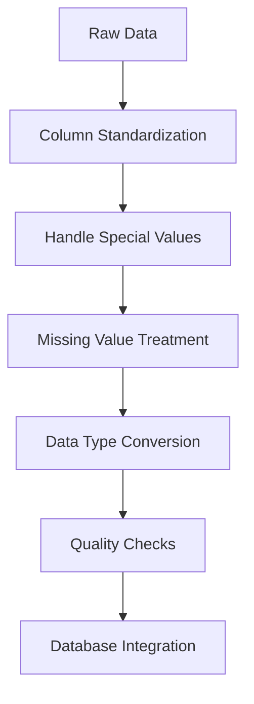
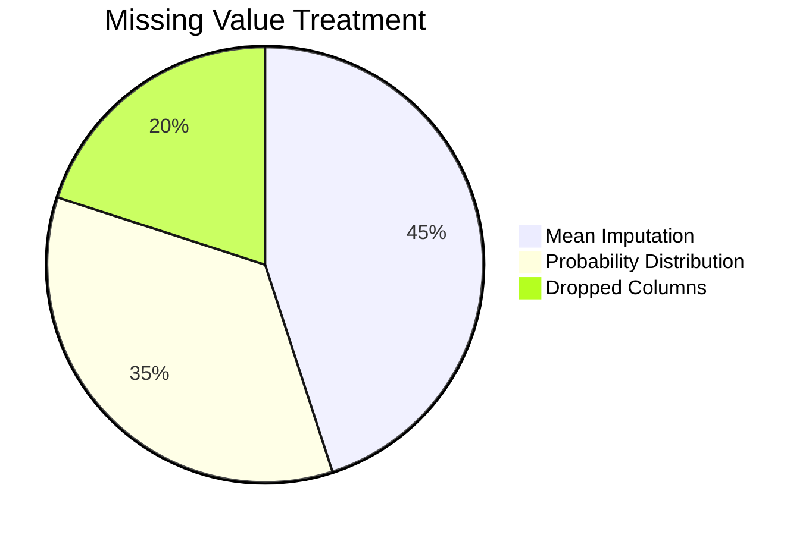
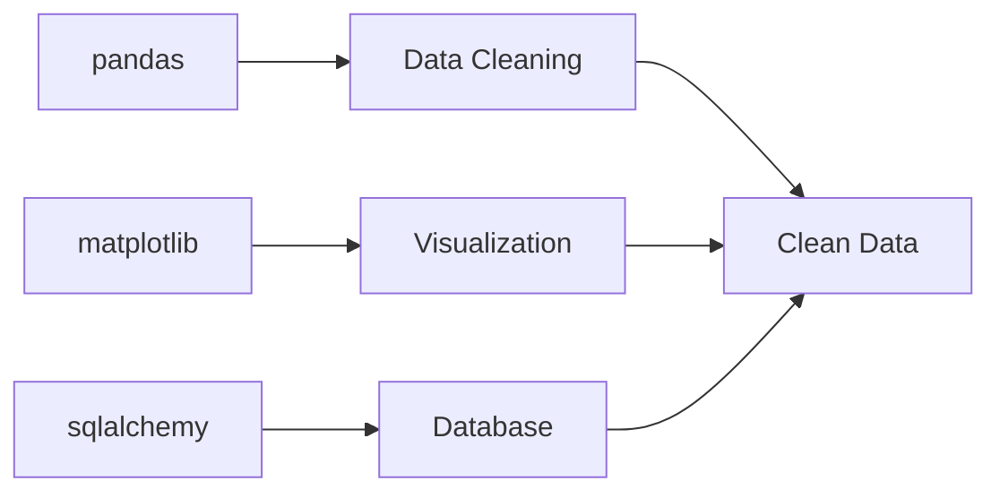

# 📊 NYC Schools SAT Results Data Cleaning Project



## 🏫 Overview
This project cleans and prepares NYC school SAT results data for analysis. The dataset contains information about SAT test participation and scores across various schools in New York City.


## 🧹 Data Cleaning Process

### 🔑 Key Cleaning Steps

| Step | Description | Tools/Methods Used |
|------|------------|--------------------|
| 1️⃣ Column Standardization | Normalized all column names | `re.sub()`, `str.lower()` |
| 2️⃣ Special Values | Handled 's' (suppressed data) | `.replace()`, `np.nan` |
| 3️⃣ Missing Values | Imputed based on data type | Mean imputation, Probability distribution |
| 4️⃣ Data Types | Ensured proper typing | `astype()`, string manipulation |
| 5️⃣ Quality Checks | Visual verification | `matplotlib`, `seaborn` |

### 📈 Before vs After Cleaning (Example)

**SAT Math Scores:**
```python
Before: ['455', '432', 's', '401', ...]
After: [455, 432, 404, 401, ...]  # 's' replaced with mean
```

## 🚧 Challenges Encountered

| Challenge | Solution | Impact |
|-----------|----------|--------|
| 🚫 Special 's' values | Replaced with NaN then imputed | Preserved data integrity |
| 🔢 Mixed data types | Systematic type conversion | Enabled numerical analysis |
| 📉 Missing values | Context-appropriate imputation | Maintained distribution |
| 🗃️ DB integration | Schema mapping | Ensured compatibility |



## 🗄️ Database Integration

### 🐘 PostgreSQL Schema

```sql
CREATE TABLE nyc_schools.sultan_sat_results (
    dbn TEXT PRIMARY KEY,
    school_name TEXT NOT NULL,
    num_of_sat_test_takers INTEGER CHECK (num_of_sat_test_takers > 0),
    sat_critical_reading_avg_score INTEGER CHECK (score BETWEEN 200 AND 800),
    sat_math_avg_score INTEGER CHECK (score BETWEEN 200 AND 800),
    sat_writing_avg_score INTEGER CHECK (score BETWEEN 200 AND 800),
    contact_extension TEXT,
    pct_students_tested INTEGER CHECK (pct BETWEEN 0 AND 100),
    academic_tier_rating TEXT
);
```

### 🔌 Integration Strategy

1. **Connection**:
   ```python
   engine = create_engine(DATABASE_URL)
   ```
   
2. **Data Loading**:
   ```python
   data.to_sql(name='sultan_sat_results', 
              con=engine,
              schema='nyc_schools',
              if_exists='replace')
   ```

3. **Backup**:
   - Saved cleaned data to CSV
   - Maintained database schema documentation

## 🛠️ Usage

### 📥 Loading Options

**Option 1: From CSV**
```python
df = pd.read_csv('cleaned_data.csv')
```

**Option 2: From Database**
```python
query = """
SELECT school_name, 
       sat_math_avg_score,
       sat_writing_avg_score
FROM nyc_schools.sultan_sat_results
WHERE pct_students_tested > 50
"""
df = pd.read_sql(query, engine)
```

## 📦 Dependencies

| Package | Version | Purpose |
|---------|---------|---------|
| pandas | ≥1.0 | Data manipulation |
| numpy | ≥1.18 | Numerical operations |
| matplotlib | ≥3.0 | Visualization |
| seaborn | ≥0.11 | Enhanced viz |
| sqlalchemy | ≥1.3 | Database ORM |
| psycopg2 | ≥2.8 | PostgreSQL adapter |



## 📜 License
MIT License - Free for educational and research purposes


---
